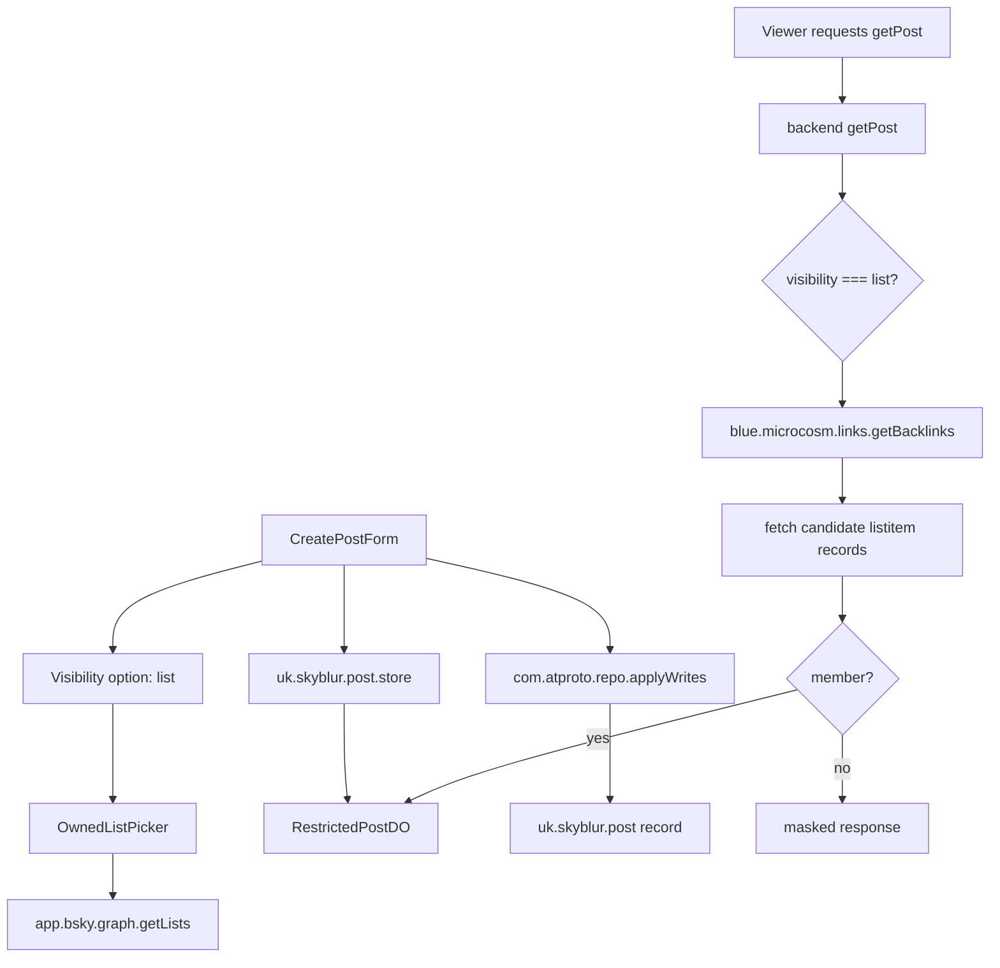

# 設計書

## 概要

リスト限定公開は、既存の制限付き公開範囲に `list` を追加し、投稿者が所有する Bluesky リストのメンバーだけに Skyblur の伏せ字本文と補足情報を表示する機能である。

実装は既存の `followers` / `following` / `mutual` と同じ restricted content flow を拡張する。公開 AT Protocol record には伏せ字本文、公開範囲、選択リスト URI を保存し、隠し本文と補足情報は `uk.skyblur.post.store` 経由で `RestrictedPostDO` に保存する。閲覧時は backend の `uk.skyblur.post.getPost` が認証 DID、投稿者 DID、選択リスト URI、`blue.microcosm.links.getBacklinks` の結果を使って認可する。

UI では `CreatePost.tsx` の公開設定に「リスト限定」を追加し、単純な Select ではなく、リスト名・説明・メンバー数などの要約、選択状態、読み込み/空/エラー状態を持つ専用のリスト選択 UI を追加する。リスト一覧はログイン中 DID の所有リストだけを `app.bsky.graph.getLists` から取得する。

### 既存 UI 観察

Playwright で `http://localhost:4500/console` の投稿作成 UI を確認した。既存 UI は白背景を基調に、細い境界線、淡い青の選択状態、控えめな説明文、固定高さのアイコン付きボタンで構成されている。

- 投稿フォームは中央寄せの狭めのカラムに縦積みされる。
- セクション見出しは小さく太すぎないテキストで、説明文は薄いグレーの 14px 前後。
- 入力欄は角丸が控えめで、境界線と余白で静かに区切る。
- 公開範囲は現状 desktop では 6 個の 70px 高タイルを横一列、mobile では 2 列グリッドで表示する。
- リスト限定追加後は 7 個を無理に横一列にせず、desktop/tablet では 4 + 3 の 2 行グリッド、mobile では既存どおり 2 列グリッドにする。
- 公開範囲タイルは lucide icon + 短いラベルの縦並びで、選択中は淡い青背景と青い icon/text になる。
- 返信制限は pill/chip 型で、選択時は青い outline と check icon を使う。
- CTA は投稿ボタンが右寄せ/中央寄せで、disabled 時は薄いグレーになる。

リスト選択 UI は、この静かな実用 UI を踏襲する。派手な装飾や大きなカードではなく、2 行化した公開範囲タイルの下に自然に続く「少し情報量のある compact picker」として設計する。

## Steering Document Alignment

### Technical Standards (tech.md)

- TypeScript、Next.js、React、Mantine、lucide-react、zustand、atcute client を使う。
- Lexicon JSON を source of truth とし、frontend/backend の生成型を同期する。
- 制限付きコンテンツは deny-by-default とし、認証・認可・外部 API の失敗時は隠し本文や補足情報を返さない。
- Next.js build は権限付きで実行する。
- WebKit を重視して E2E を確認する。

### Project Structure (structure.md)

- UI は `frontend/src/components/` に配置する。
- 共有 visibility 定数と型は `frontend/src/types/types.ts` に追加する。
- temporary draft state は `frontend/src/state/TempPost.ts` に追加する。
- backend の認可処理は `backend/src/api/getPost.ts` から helper へ分離する。
- Lexicon JSON は `lexicon/uk/skyblur/post/*.json` を更新し、生成物は `frontend/src/lexicon/` と `backend/src/lexicon/` に同期する。
- テストは frontend `__test__` / E2E、backend `__tests__` に追加する。

## Code Reuse Analysis

### Existing Components to Leverage

- **`CreatePostForm` (`frontend/src/components/CreatePost.tsx`)**: 公開範囲選択、restricted content 保存、Bluesky record 作成、編集時 cleanup の既存 flow を拡張する。
- **`ConsoleContent` (`frontend/src/app/console/ConsoleContent.tsx`)**: console 一覧で既存 restricted content を `getPost` から取得する条件に `list` を追加する。
- **`PostList` (`frontend/src/components/PostList.tsx`)**: 一覧上の restricted 表示、ログイン必須表示、復号/取得 flow に `list` を追加する。
- **投稿詳細 page (`frontend/src/app/post/[did]/[rkey]/main.tsx`, `PostPage.module.css`)**: visibility badge、`data-tone="list"` の CSS、未認可メッセージに `list` を追加する。
- **`DropdownMenu` (`frontend/src/components/DropdownMenu.tsx`)**: 投稿削除時の restricted content cleanup 条件に `list` を追加する。
- **`RestrictedPostDO` (`backend/src/api/RestrictedPostDO.ts`)**: `listUri` などの metadata を保存できるよう schema と PUT/GET response を拡張する。
- **`store` handler (`backend/src/api/store.ts`)**: `list` visibility と `listUri` を validation 後に DO へ保存する。
- **`getPost` handler (`backend/src/api/getPost.ts`)**: 既存の relationship authorization branch に `list` authorization を追加する。
- **locale files (`frontend/src/locales/ja.ts`, `frontend/src/locales/en.ts`)**: ラベル、説明、validation、`NotListMember` / `ListMembershipCheckFailed` / `ListUriMissing` / `InvalidListUri` の認可メッセージを追加する。
- **terms (`frontend/src/locales/terms/ja.md`, `frontend/src/locales/terms/en.md`)**: list visibility で Cloudflare、PDS、Bluesky API、constellation、閲覧者 PDS への通信が発生することを追記する。
- **E2E mocks (`frontend/e2e/oauth-mock.ts`)**: `app.bsky.graph.getLists` / `app.bsky.graph.getList` / `blue.microcosm.links.getBacklinks` / candidate `com.atproto.repo.getRecord` の mock response を追加する。

### Integration Points

- **`app.bsky.graph.getLists`**: 投稿者自身のリスト一覧取得に使用する。`actor` はログイン中 DID、`limit` は 100、必要に応じて cursor paging を行う。
- **`blue.microcosm.links.getBacklinks`**: list membership 判定に使用する。戻り値は list item の本文ではなく `{ did, collection, rkey }` の候補 record なので、`subject=<requester DID>`、`source=app.bsky.graph.listitem:subject`、`did=<author DID>` で閲覧者を含む list item 候補を取得し、その候補 record を別途取得して `value.list === selected list URI` を検証する。
- **`app.bsky.graph.getList`**: 投稿詳細・投稿一覧・編集時に、保存済み `listUri` からリスト名や `listItemCount` を hydrate できる場合に使用する。取得に失敗した場合は list URI の短縮表示へフォールバックする。
- **`uk.skyblur.post.store`**: restricted content と選択 list metadata を保存する。
- **`uk.skyblur.post.getPost`**: list visibility の認可と restricted content 取得を行う。
- **`com.atproto.repo.applyWrites`**: `uk.skyblur.post` record に `visibility: "list"` と `listUri` を保存する。

## Architecture



### Modular Design Principles

- **Single File Responsibility**: リスト選択 UI、list API helper、backend list authorization helper を分離する。
- **Component Isolation**: `OwnedListPicker` は `CreatePostForm` から props/state で制御し、投稿処理本体と描画を混ぜない。
- **Service Layer Separation**: frontend の list fetch、backend の membership check、DO storage を別関数にする。
- **Utility Modularity**: visibility 判定は `isRestrictedVisibility` / `isListVisibility` のような helper へ寄せる。

## Components and Interfaces

### `OwnedListPicker`

- **Purpose:** 投稿者が所有する Bluesky リストを選ぶ専用 UI。
- **Location:** `frontend/src/components/OwnedListPicker.tsx`
- **Interfaces:**
  - `value?: string`
  - `onChange: (list: OwnedListOption | null) => void`
  - `did: string`
  - `agent: Client | null`
  - `disabled?: boolean`
  - `error?: string`
- **Dependencies:** Mantine (`Button`, `TextInput`, `Group`, `Badge`, `Alert`, `Skeleton` など)、lucide-react、atcute client。
- **Reuses:** `useLocale`, existing Mantine styling patterns。
- **UI design:**
  - visibility option grid は `SimpleGrid` の列数を見直し、7 個目追加後もタイル幅を細くしすぎない。desktop/tablet は 4 列、mobile は 2 列を基本にする。
  - 既存 6 個のタイルも同じ grid に載せ、リスト限定だけが浮いて見えないようにする。
  - 7 個目のリスト限定タイルは `List` または `ListChecks` 系 icon と短いラベル「リスト限定」を使い、既存タイルと同じ 70px 高、icon + label の縦並びにする。
  - 公開範囲タイルの直下に、同じ横幅の compact panel として表示する。
  - panel は白背景、薄い border、8px 以下の控えめな border radius、既存説明文と同じグレー階調を使う。
  - リストごとに高さ 64〜80px 程度の list row を使い、必要以上に大きな card にしない。
  - list row は左に `List` または `Users` 系 icon、中央にリスト名と説明、右に member count/purpose badge と選択 check を置く。
  - リスト名は既存 UI の本文と同程度の weight にし、説明は薄いグレーで 1〜2 行まで表示する。
  - 選択中の row は公開範囲タイルと同じ淡い青背景、青 border、check icon で明確に示す。
  - hover/focus は既存 Button/Chip と同じく控えめな青 tone にする。
  - 長い名前・説明は折り返しまたは line clamp し、ボタン内で overflow させない。
  - 件数が多い場合は panel 上部に 36px 高の検索入力を置き、既存 TextInput と同じ見た目にする。
  - loading は Skeleton row を 2〜3 本表示し、公開範囲以下の layout shift を抑える。
  - empty は `Alert` 風の薄い panel として表示し、所有リストだけが対象であることを説明する。
  - error は赤を強く出しすぎず、再取得 button を添える。
  - validation error は picker panel の直下に小さな赤系テキストで表示する。
  - mobile では公開範囲タイルの 2 列グリッドの下に full-width panel として表示し、list row は 1 列にする。

### `listVisibility` frontend helper

- **Purpose:** リスト一覧取得、所有者フィルタ、表示用 option 変換。
- **Location:** `frontend/src/logic/listVisibility.ts`
- **Interfaces:**
  - `fetchOwnedLists(agent, did): Promise<OwnedListOption[]>`
  - `fetchListSummary(agent, listUri): Promise<OwnedListOption | null>`
  - `normalizeListView(view): OwnedListOption | null`
  - `isListVisibility(visibility: string | undefined): boolean`
  - `isRestrictedVisibility(visibility: string | undefined): boolean`
- **Dependencies:** `@atcute/client`, `@atcute/bluesky` types。
- **Reuses:** `useXrpcAgentStore` が持つ authenticated `agent`。
- **Usage:** `CreatePost.tsx`、`ConsoleContent.tsx`、`PostList.tsx`、投稿詳細 page、`DropdownMenu.tsx` の `followers/following/mutual` 直書き条件を helper に寄せ、`list` の追加漏れを防ぐ。
- **List metadata mapping:** `app.bsky.graph.defs#listView.listItemCount` を `OwnedListOption.memberCount` に対応させる。`name` を取得できない場合は `listUri` の rkey または短縮 URI を表示名 fallback にする。
- **Owner filtering:** `fetchOwnedLists` は `actor=did` に加えて、返却された `list.creator.did` がログイン DID と一致することを確認してから option 化する。
- **Summary fetch:** `fetchListSummary` は `app.bsky.graph.getList` を `list=<listUri>`、`limit=1` で呼び、表示用の `list` object だけを利用する。items は UI 表示や認可判定に使わない。
- **Edit hydration:** `prevBlur.blur.listUri` がある編集では `OwnedListPicker` の `value` に渡して preselect し、`fetchListSummary` で表示名を補完する。取得できない場合でも URI を保持し、投稿者が別リストを選ぶまで保存済み `listUri` を落とさない。

### Shared visibility state

- **Purpose:** `list` を既存公開範囲と同じ定数・draft state で扱い、UI 分岐の追加漏れを防ぐ。
- **Locations:**
  - `frontend/src/types/types.ts`
  - `frontend/src/state/TempPost.ts`
- **Changes:**
  - `VISIBILITY_LIST = "list"` を追加する。
  - `TempPost` state に `listUri?: string` と `setListUri(listUri?: string)` を追加する。
  - visibility が `list` 以外へ変わったときは draft の `listUri` を clear し、`list` のまま本文・補足情報を編集する場合は保持する。

### `listVisibility` backend helper

- **Purpose:** list URI validation、owner verification、membership authorization。
- **Location:** `backend/src/api/listVisibility.ts`
- **Interfaces:**
  - `isValidListUri(listUri: string, repoDid: string): boolean`
  - `assertListOwnedByRepo(listUri: string, repoDid: string): boolean`
  - `checkListMembership(params): Promise<ListAuthorizationResult>`
- **Dependencies:** Hono context headers、`simpleFetchHandler`、`fetchServiceEndpoint`、`fetch`。`blue.microcosm.links.getBacklinks` は Skyblur Lexicon ではないため、生成済み atcute 型に依存せず、response を runtime validation する。
- **Reuses:** `getPost.ts` の requester/repo/rkey parsing。
- **Backlinks request:**
  - service: `https://constellation.microcosm.blue`。設定可能な定数にし、テストでは mock できるようにする。
  - endpoint: `GET https://constellation.microcosm.blue/xrpc/blue.microcosm.links.getBacklinks`
  - query:
    - `subject`: 閲覧者 DID。`URLSearchParams` などで exactly once URL encode し、手動 encode と query builder の二重 encode を避ける。
    - `source`: `app.bsky.graph.listitem:subject`
    - `did`: 投稿者 DID。list item は投稿者の repo に作成されるため、投稿者の list item だけに絞る。
    - `limit`: 最大値の `100`。この endpoint の query parameter には cursor がないため、1 request で取得できる候補だけを検証対象にする。
    - `reverse`: `false`
  - response:
    ```ts
    type BacklinksResponse = {
      total: number;
      records: Array<{
        did: string;
        collection: string;
        rkey: string;
      }>;
    };
    ```
  - `records` はリンク元 record の位置だけを返す。`app.bsky.graph.listitem` の `list` 値は戻り値に含まれないため、各候補について `at://${did}/${collection}/${rkey}` の record を取得して `value.subject === requesterDid` かつ `value.list === listUri` を確認する。
  - 候補 record 取得は list item の repo DID ごとの PDS を `fetchServiceEndpoint(did)` で解決し、`com.atproto.repo.getRecord` を `collection` と `rkey` 付きで呼び出す。`did !== authorDid` または `collection !== "app.bsky.graph.listitem"` の候補は不正応答として無視する。
  - `total > 0` だけでは許可しない。必ず候補 record の中身を検証する。
  - `total > records.length` かつ一致する候補が見つからない場合、endpoint だけでは非メンバーと断定できないため、deny-by-default で `ListMembershipCheckFailed` とする。

### Lexicon schemas

- **Purpose:** `list` visibility と `listUri` を record/procedure に追加する。
- **Locations:**
  - `lexicon/uk/skyblur/post/record.json`
  - `lexicon/uk/skyblur/post/store.json`
  - `lexicon/uk/skyblur/post/getPost.json`
- **Interfaces:**
  - `visibility` enum に `"list"` を追加。
  - `listUri` property を追加。`format: "at-uri"`。
  - `store` input では `visibility === "list"` のとき application validation で `listUri` 必須にする。
  - `getPost` output に optional `listUri` を追加し、authorized response、masked response、認可エラー response のいずれでも、公開 record に保存された `listUri` を UI が参照できるようにする。
- **Generated files:**
  - `frontend/src/lexicon/**`
  - `backend/src/lexicon/**`

### Restricted storage

- **Purpose:** restricted content と list metadata の永続化。
- **Location:** `backend/src/api/RestrictedPostDO.ts`
- **Changes:**
  - SQLite `posts` table に `list_uri TEXT` を追加する。
  - 既存行との互換のため、constructor で migration-safe に `ALTER TABLE` を試行し、既に存在する場合は無視する。
  - GET response に `listUri` を含める。
  - PUT body から `listUri` を受け取る。

### Backend store validation

- **Purpose:** `uk.skyblur.post.store` で runtime validation と list 固有の application validation を両方行う。
- **Location:** `backend/src/api/store.ts`
- **Current behavior:** `safeParse(UkSkyblurPostStore.mainSchema.input.schema, body)` により、Lexicon 生成 schema で `text`、`additional`、`uri`、`visibility` の型・長さ・enum を検証している。
- **Changes:**
  - Lexicon 更新後も `safeParse` を最初に実行し、不正な body は DO に到達させない。
  - `visibility === "list"` の場合は `listUri` が存在すること、`isValidListUri(listUri, requesterDid)` を満たすこと、投稿者所有 list URI であることを `store.ts` で追加検証する。
  - `visibility !== "list"` の場合は `listUri` を保存しない、または null として扱い、既存 restricted visibility の挙動を変えない。
  - DO へ渡す body には `listUri` を含め、`RestrictedPostDO` 側でも unknown body を信用せず必要最小限の shape を確認する。

### Backend delete validation

- **Purpose:** list visibility も既存 restricted content と同じ deletion/cleanup flow で扱い、削除 API の入力検証も維持する。
- **Location:** `backend/src/api/deleteStored.ts`
- **Changes:**
  - `uk.skyblur.post.deleteStored` の Lexicon schema に対して runtime validation を行う。現状は `body.uri` を直接読んでいるため、store と同じく schema validation を通す。
  - `uri` が authenticated DID の `uk.skyblur.post` record を指すことを引き続き確認する。
  - list visibility 固有の削除処理は追加せず、rkey 単位の DO row 削除として既存 restricted visibility と同じ挙動にする。

## Data Models

### Visibility

```ts
type SkyblurVisibility =
  | "public"
  | "password"
  | "login"
  | "followers"
  | "following"
  | "mutual"
  | "list";
```

### `uk.skyblur.post` record

```ts
type SkyblurPostRecord = {
  uri: string;        // at-uri of referenced Bluesky post
  text: string;       // public/masked text
  createdAt: string;
  visibility: SkyblurVisibility;
  additional?: string;
  encryptBody?: Blob;
  listUri?: string;   // visibility === "list" のとき必須扱い
};
```

### `uk.skyblur.post.store` input

```ts
type StoreRestrictedPostInput = {
  text: string;
  additional?: string;
  uri: string;
  visibility: "followers" | "following" | "mutual" | "list";
  listUri?: string;
};
```

### `uk.skyblur.post.getPost` output

```ts
type GetPostOutput = {
  text?: string;
  additional?: string;
  message?: string;
  errorCode?: string;
  errorDescription?: string;
  createdAt?: string;
  visibility?: SkyblurVisibility;
  listUri?: string;
};
```

### `OwnedListOption`

```ts
type OwnedListOption = {
  uri: string;
  cid?: string;
  name: string;
  description?: string;
  purpose?: string;
  avatar?: string;
  memberCount?: number;
};
```

### `ListAuthorizationResult`

```ts
type ListAuthorizationResult =
  | { ok: true }
  | {
      ok: false;
      errorCode:
        | "AuthRequired"
        | "ListUriMissing"
        | "InvalidListUri"
        | "NotListMember"
        | "ListMembershipCheckFailed";
      errorDescription: string;
    };
```

### `BacklinksResponse`

```ts
type BacklinksResponse = {
  total: number;
  records: Array<{
    did: string;
    collection: string;
    rkey: string;
  }>;
};
```

### `ListItemRecord`

```ts
type ListItemRecord = {
  $type: "app.bsky.graph.listitem";
  subject: string; // list に含まれる DID
  list: string;    // app.bsky.graph.list の AT URI
  createdAt: string;
};
```

## Error Handling

### Error Scenarios

1. **投稿者がリストを選ばずに投稿する**
   - **Handling:** frontend で投稿前 validation を行い、`uk.skyblur.post.store` を呼ばない。backend でも `visibility === "list"` かつ `listUri` なしを 400 にする。
   - **User Impact:** リスト選択 UI の近くに「リストを選択してください」を表示する。

2. **リスト一覧取得に失敗する**
   - **Handling:** `OwnedListPicker` に retry 可能な error state を表示する。投稿ボタンは list visibility では無効化または validation error にする。
   - **User Impact:** 投稿者は公開範囲を変更するか、再取得を試せる。

3. **投稿者所有リストがない**
   - **Handling:** empty state を表示し、list visibility の投稿を禁止する。
   - **User Impact:** 「自分のリストがありません」と表示する。

4. **未ログイン閲覧者が list visibility を要求する**
   - **Handling:** 既存 restricted visibility と同様に masked text、空 additional、`AuthRequired` を返す。
   - **User Impact:** UI はログイン必須メッセージを表示する。

5. **閲覧者がリストメンバーではない**
   - **Handling:** `NotListMember` を返し、hidden content は返さない。
   - **User Impact:** UI はリスト限定用の権限不足メッセージを表示する。

6. **backlinks API が失敗または不正応答**
   - **Handling:** deny-by-default で `ListMembershipCheckFailed` を返す。
   - **User Impact:** UI は「閲覧権限を確認できませんでした」系の recoverable message を表示する。

7. **保存済み list URI の表示名取得に失敗する**
   - **Handling:** `fetchListSummary` の失敗は投稿作成・閲覧・編集フローを止めず、短縮 list URI を表示する。認可判定では display metadata を使わない。
   - **User Impact:** リスト名の代わりに安定した識別子が表示される。

8. **DO 内に restricted content がない**
   - **Handling:** 既存と同様に `ContentMissing` を返す。
   - **User Impact:** UI は投稿データが見つからない表示を行う。

9. **リスト限定のエラーコードが UI に届く**
   - **Handling:** `ConsoleContent`、`PostList`、投稿詳細 page は `NotListMember` / `ListMembershipCheckFailed` / `ListUriMissing` / `InvalidListUri` を汎用エラーに潰さず、list-specific locale message へ mapping する。
   - **User Impact:** 閲覧者は「権限がない」のか「確認できない」のかを、実装詳細を見ずに理解できる。

## Testing Strategy

### Unit Testing

- **frontend**
  - `isRestrictedVisibility` が `followers` / `following` / `mutual` / `list` を true にし、`public` / `login` / `password` は既存意図どおり扱うこと。
  - `fetchOwnedLists` が `app.bsky.graph.getLists` を paging し、actor と `list.creator.did` がログイン DID になること。
  - `fetchListSummary` が `app.bsky.graph.getList` を `limit=1` で呼び、`list` から表示名、説明、purpose、`listItemCount` を option に変換し、取得失敗時は null を返すこと。
  - `OwnedListPicker` の loading / empty / error / selected / validation error state。
  - 編集時に `prevBlur.blur.listUri` が `OwnedListPicker` に preselect され、表示名取得に失敗しても `listUri` が維持されること。
  - long list name / description が layout overflow しないよう、component test または E2E screenshot で確認する。
  - `TempPost` が `listUri` を保持・復元できること。
  - `PostPage.module.css` に `data-tone="list"` の badge style があり、既存 tone と視覚的に調和すること。

- **backend**
  - `isValidListUri` が `at://{repoDid}/app.bsky.graph.list/{rkey}` のみ許可すること。
  - `store` が Lexicon schema に対して `safeParse` を実行し、失敗時は 400 を返して DO に書き込まないこと。
  - `store` が `visibility: "list"` で `listUri` 必須にすること。
  - `store` が `visibility !== "list"` のとき `listUri` を保存しない、または null として扱うこと。
  - `deleteStored` が Lexicon schema に対して runtime validation を実行し、不正な `uri` body を 400 にすること。
  - `RestrictedPostDO` が `listUri` を PUT/GET でき、既存 rows と互換性があること。
  - `getPost` が list visibility の成功・失敗 response で `listUri` を落とさないこと。
  - `blue.microcosm.links.getBacklinks` request が `subject` を exactly once URL encode し、二重 encode しないこと。
  - `checkListMembership` が `BacklinksResponse` の `records` から候補 list item record を取得し、`value.subject` と `value.list` の一致を検証すること。
  - `checkListMembership` が `did !== authorDid` や `collection !== "app.bsky.graph.listitem"` の候補を許可に使わないこと。
  - `checkListMembership` が `total > records.length` で一致候補を確認できない場合、`ListMembershipCheckFailed` を返すこと。
  - `checkListMembership` が success / non-member / API failure / malformed response / candidate record mismatch を返すこと。
  - `getPost` が author access、unauthenticated、member、non-member、check failure を処理すること。

### Integration Testing

- Lexicon JSON 変更後に `rtk pnpm gen-lex` を frontend/backend の両方で実行し、生成型が更新され、TypeScript build が通ること。
- `uk.skyblur.post.store` → DO 保存 → `uk.skyblur.post.getPost` の list visibility flow。
- `https://constellation.microcosm.blue/xrpc/blue.microcosm.links.getBacklinks` と candidate `com.atproto.repo.getRecord` を mock し、member / non-member / unbounded candidates を検証する。
- `frontend/e2e/oauth-mock.ts` を list API 用に拡張し、console/post detail の既存 E2E が mock 環境で落ちないこと。
- 既存 `followers` / `following` / `mutual` / `password` / `public` の regression。

### End-to-End Testing

- 投稿作成 UI で list visibility を選ぶと polished な list picker が表示されること。
- 自分の所有リストだけが表示されること。
- リスト未選択では投稿できないこと。
- list visibility 投稿を編集すると、保存済みリストが preselect されること。
- list visibility 投稿後、投稿詳細で list badge と list-specific message が表示されること。
- list name が取得できる場合は表示し、取得できない場合は短縮 list URI に fallback すること。
- 未ログイン閲覧者は login required になること。
- 非メンバーは not authorized になること。
- WebKit desktop/mobile で list picker の text overflow と layout collapse がないこと。

## Migration and Compatibility

- `visibility` に `"list"` を追加しても、既存 record の値は変えない。
- `listUri` は optional field として追加し、`visibility === "list"` の場合のみ application validation で必須にする。
- `RestrictedPostDO` の schema 追加は既存 table に対して安全に行う。
- 既存 restricted visibility の DO rows は `list_uri` が null のまま動作する。
- terms/locales は list visibility の制約を説明できるよう更新する。
- terms は日本語・英語の両方で、list visibility の判定に Bluesky API、constellation、閲覧者または list item repo の PDS への通信が発生することを説明する。

## Open Questions / Validation Points

1. `blue.microcosm.links.getBacklinks` は query parameter として cursor を提供していないため、`limit=100` で一致候補を取得できないケースを `ListMembershipCheckFailed` として扱う。
2. `app.bsky.graph.listitem:subject` と `did=<author DID>` の組み合わせで、閲覧者を含む投稿者所有 list item 候補を取得できることをテストで固定する。
3. member count が `app.bsky.graph.getLists` の response で取得できない場合、UI は member count 表示を省略し、説明・purpose・URI fallback を使う。
