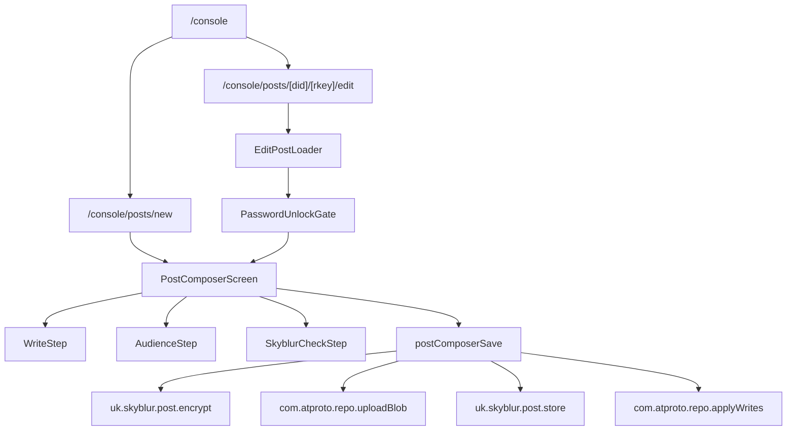

# 設計書

## 概要

投稿画面刷新では、既存の `/console` 内に埋め込まれている `CreatePostForm` を、投稿作成・編集専用 route と複数の小さな UI/logic モジュールへ分離する。体験の中心は `書く`、`見せる相手`、`投稿前チェック` の 3 ステップであり、投稿前チェックは Skyblur 固有の公開事故防止体験である `Skyblur Check` として扱う。

本設計は、既存の AT Protocol / XRPC / Lexicon / OAuth / Durable Object の意味を変えず、UI の情報設計、状態管理、保存処理の分離、E2E 対象 route を整理する。MVP では保存形式をまたぐ公開範囲移行を扱わず、投稿前に何がどこへ見えるか迷わず確認できる composer を先に成立させる。

主な方針は次の通り。

- `/console` は投稿済みコンテンツ管理と作成導線に集中する。
- 新規投稿は `/console/posts/new`、編集は `/console/posts/[did]/[rkey]/edit` で扱う。
- パスワード投稿の編集では、編集画面表示前に解除用パスワードで復号し、復号済みの本文・補足だけを composer に渡す。
- 保存処理は「表示 UI」から分離し、MVP では既存保存形式を維持する保存計画として組み立てる。
- 永続的な下書き一覧は作らず、ステップ間保持、未保存変更の離脱確認、保存失敗時の入力保持に限定する。
- ロケールは既存の flat な `locale.CreatePost_*` 互換を維持し、MVP では `PostComposer_*` などの prefix 整理に留める。

`Skyblur Check` は単なる投稿前サマリーではなく、Bluesky に公開される情報と Skyblur で閲覧可能な情報の差分を投稿者に確信させる公開事故防止体験である。今回の刷新の主役は「フォームを 3 つに分けること」ではなく、投稿前に公開範囲と表示差分を理解してから保存できることである。

## Steering Document Alignment

### Technical Standards (tech.md)

- TypeScript / Next.js App Router / React / Mantine / lucide-react / zustand / atcute を継続利用し、新規依存は追加しない。
- XRPC 呼び出しは既存の `agent` / `apiProxyAgent` を利用し、UI から backend Durable Object へ直接依存しない。
- パスワード、復号済み本文、補足、暗号化前データはログ、通知、URL、サーバー側の不要な途中状態に残さない。投稿者本人のブラウザ内の一時保持は許容するが、投稿成功、明示破棄、logout/session change で必ず clear する。
- 制限付きコンテンツは deny-by-default を維持し、認可判定や保存形式は既存 Lexicon と backend API の意味に合わせる。
- WebKit を重要対象として、production route 上の E2E を整備する。

### Project Structure (structure.md)

- `frontend/src/app/console` は console 管理画面に残し、投稿作成・編集 route を `frontend/src/app/console/posts/...` に追加する。
- 大きくなっている `frontend/src/components/CreatePost.tsx` へ直接機能を積まず、投稿 composer 専用 component を `frontend/src/components/post-composer/` に分離する。
- 投稿本文変換、visibility summary、保存計画、dirty state 判定などの UI から再利用される処理は `frontend/src/logic/postComposer/` に置く。
- 共有型は `frontend/src/types/types.ts` の既存 visibility 定数と整合させ、必要に応じて `frontend/src/types/postComposer.ts` へ分離する。
- ロケールは `frontend/src/locales/` 配下の既存 `ja.ts` / `en.ts` export 互換を維持する。MVP では専用 prefix で追加し、ファイル分割は次フェーズで扱う。

## Code Reuse Analysis

### Existing Components to Leverage

- **CreatePostForm**: 現行の投稿本文変換、Bluesky 投稿作成、暗号化、Blob upload、制限付き保存、applyWrites の流れを移植元として利用する。最終形では wrapper または旧互換部品として縮小する。
- **PostList**: `/console` の投稿一覧とパスワード解除 UI を継続利用する。編集導線は mode 切替ではなく専用 edit route への遷移へ変更する。
- **OwnedListPicker**: リスト限定公開のリスト選択 UI と読み込み/再試行表示を再利用する。
- **ReplyList**: 返信先選択 UI を `見せる相手` または詳細設定セクションで再利用する。
- **AutoResizeTextArea**: 本文・補足入力と選択範囲を `[]` で囲む操作を継続利用する。
- **PostTextWithBold / HeroDemo の伏せ字表示ロジック**: Skyblur Check の preview 表示で、伏せ字/非伏せ字表現の既存挙動を参考にする。

### Existing Logic / State to Leverage

- **useXrpcAgentStore**: `agent`、`apiProxyAgent`、`did`、`serviceUrl`、session 状態を route loader と composer で利用する。
- **useLocale**: 既存の locale 取得口を維持し、MVP では flat export に専用 prefix の文言を追加する。
- **useTempPostStore**: 新規投稿のステップ間保持に利用する。password 投稿の一時保持は投稿者本人のブラウザ内に限定し、投稿成功、明示破棄、logout/session change で必ず clear できる境界を設ける。
- **listVisibility.ts**: `isListVisibility`、`isRestrictedVisibility` を visibility 判定の source として再利用する。
- **types.ts visibility constants**: `VISIBILITY_PUBLIC`、`VISIBILITY_PASSWORD`、`VISIBILITY_LOGIN`、`VISIBILITY_FOLLOWERS`、`VISIBILITY_FOLLOWING`、`VISIBILITY_MUTUAL`、`VISIBILITY_LIST` を継続利用する。

### Integration Points

- **AT Protocol repo writes**: `com.atproto.repo.applyWrites` で Bluesky post、threadgate/postgate、Skyblur record の create/update を行う。
- **Password encryption**: `uk.skyblur.post.encrypt` で暗号化し、`com.atproto.repo.uploadBlob` で暗号 blob を PDS に保存する。
- **Password unlock**: `uk.skyblur.post.decryptByCid` route を使い、edit route の unlock gate で復号済み本文・補足を取得する。
- **Restricted content store**: `uk.skyblur.post.store` で followers/following/mutual/list の本文・補足を保存する。
- **Restricted cleanup**: `uk.skyblur.post.deleteStored` は既存機能として残すが、MVP の保存形式移行や補償削除には使わない。
- **Record listing/loading**: `/console` の一覧は `com.atproto.repo.listRecords`、edit route は対象 record を `com.atproto.repo.getRecord` または既存一覧データから取得する。
- **MVP Boundary**: password / restricted / public 間の保存形式移行、補償削除、cleanup retry は MVP では実装しない。

## Architecture

投稿 composer は route container、UI steps、pure logic、save orchestrator に分離する。



### Route Responsibilities

- `/console`
  - 認証済み console home。
  - 作成ボタンと投稿一覧を表示する。
  - `CreatePostForm` を inline 表示しない。
  - 編集ボタンは edit route へ遷移する。
  - 投稿作成・編集完了後の戻り先になる。

- `/console/posts/new`
  - 新規投稿 composer を表示する。
  - `useTempPostStore` から新規投稿の入力途中状態を復元する。
  - 初期 visibility は `public`。
  - キャンセル時は未保存変更があれば確認し、破棄後に `/console` へ戻る。
  - 保存完了時は一時入力を破棄して `/console` へ戻る。

- `/console/posts/[did]/[rkey]/edit`
  - 対象 Skyblur record を読み込む。
  - `did` がログイン DID と一致しない場合は編集不可にする。
  - route `did`、route `rkey`、record URI の repo/rkey、collection、record `$type`、visibility enum が一致することを検証する。
  - visibility が `password` の場合は composer 表示前に `PasswordUnlockGate` を表示する。
  - password 解除成功後、復号済み本文・補足を composer initial state として渡す。
  - restricted visibility の場合は `uk.skyblur.post.getPost` で編集用の本文・補足を取得し、取得できない場合は masked record のまま保存させない。
  - MVP では保存形式をまたぐ公開範囲変更は許可せず、同じ保存形式内の本文・補足・基本設定編集に限定する。
  - 返信・引用制限は同じ投稿に紐づく Bluesky record として更新対象に含める。ただし認可 scope や対象 record の状態で更新できない場合は、本文・補足保存と混同しないエラーを表示する。
  - 既存 Bluesky post 本体の本文更新は MVP 対象外とし、Bluesky 側の伏せ字本文や OGP/card が更新されない場合は Skyblur Check で表示する。
  - 編集キャンセル時は未保存変更があれば確認し、破棄後に `/console` へ戻る。
  - 保存完了、認証切れ、編集不可、record 取得失敗、unlock 失敗からのキャンセル時は `/console` へ戻れる導線を提供する。

### Modular Design Principles

- **Single File Responsibility**: route、step UI、保存計画、テキスト変換、visibility summary を別ファイルに分ける。
- **Component Isolation**: `WriteStep`、`AudienceStep`、`SkyblurCheckStep` は props と callback だけでつなぎ、XRPC 呼び出しを持たない。
- **Service Layer Separation**: 保存処理は `postComposerSave` に集約し、UI は `PostComposerState` と `SaveResult` を扱う。
- **Utility Modularity**: bracket validation、blur text generation、保存計画、dirty state 判定を pure function 化する。
- **Compatibility First**: 既存 `CreatePost_*` locale key と visibility value を壊さず、MVP では dedicated prefix 追加に留める。
- **Lightweight Steps**: 3 ステップは強制的な儀式にせず、通常投稿では本文、公開範囲、Skyblur Check の主要判断だけで投稿まで進める。

## Components and Interfaces

### PostComposerScreen

- **Purpose:** 新規/編集の composer 全体を管理し、step state、dirty state、submit、back/leave confirmation を扱う。
- **Interfaces:**
  - `mode: 'create' | 'edit'`
  - `initialPost?: PostComposerInitialData`
  - `onComplete(result: SaveResult): void`
  - `onCancel(): void`
- **Dependencies:** `useLocale`、`useXrpcAgentStore`、`useTempPostStore`、`postComposerSave`。
- **Reuses:** 既存 `CreatePostForm` の state/handler を分解して移植する。

### PostComposerStepper

- **Purpose:** `書く`、`見せる相手`、`投稿前チェック` の現在位置、戻り、進行可否、エラー位置を表示する。
- **Interfaces:**
  - `currentStep: ComposerStep`
  - `stepStatus: Record<ComposerStep, 'idle' | 'warning' | 'complete'>`
  - `onStepChange(step): void`
- **Dependencies:** Mantine stepper 相当の UI、または既存 Mantine component の組み合わせ。
- **Reuses:** 新規依存は追加しない。
- **Mobile:** モバイルでは現在ステップ、戻る、次へ/投稿、保存中状態を見失わないよう、下部固定アクションまたは同等に常時到達しやすい構造を使う。

### WriteStep

- **Purpose:** 本文、伏せ字指定、文字数、シンプルモード、連続伏せ字省略、補足入力を扱う。
- **Interfaces:**
  - `state: PostComposerState`
  - `validation: WriteValidationResult`
  - `onChange(patch): void`
- **Dependencies:** `AutoResizeTextArea`、`buildBlurredText`、`validateBrackets`。
- **Reuses:** `CreatePost_AddBrackets`、bracket warning の既存文言と動作。

### AudienceStep

- **Purpose:** 公開範囲、パスワード、リスト、返信先、返信・引用制限を扱う。
- **Interfaces:**
  - `visibility`
  - `listUri`
  - `passwordInput`
  - `replyPost`
  - `threadGate`
  - `postGate`
  - `onChange(patch): void`
- **Dependencies:** `OwnedListPicker`、`ReplyList`、visibility constants。
- **Reuses:** 既存公開範囲選択肢と説明文。
- **UX:** 返信先、返信制限、引用制限は詳細設定として初期状態では折りたたむ。通常投稿では公開範囲だけを選べば Skyblur Check へ進める。

### SkyblurCheckStep

- **Purpose:** 投稿前に Bluesky 表示、Skyblur 表示、読める人、読めない人の見え方、補足の扱い、保存形式の変化、返信・引用設定を確認する。
- **Interfaces:**
  - `state: PostComposerState`
  - `summary: SkyblurCheckSummary`
  - `onFix(target: ComposerFixTarget): void`
  - `onSubmit(): void`
- **Dependencies:** `buildSkyblurCheckSummary`、`buildVisibilitySummary`。
- **Reuses:** Bluesky preview の既存 OGP 文言、visibility description。
- **Display Priority:** 先頭に「Bluesky に出る内容」、次に「Skyblur で読める内容」、次に「読める人/読めない人」、最後に保存形式の変化や返信・引用設定を表示する。
- **Reply/Quote Summary:** 返信制限は `threadGate`、引用制限は `postGate` として別々に要約し、どちらか一方だけ変更・保存できない場合も区別して表示する。
- **Edit Warning:** 編集時に公開範囲が広がる場合は強い確認、狭まる場合は安心材料、別種へ変わる場合は差分説明を出す。
- **Product Role:** Skyblur Check は「投稿前サマリー」ではなく、公開事故を防ぐための最終確認として扱う。

### EditPostLoader

- **Purpose:** edit route で対象 record を取得し、編集可能な initial state を組み立てる。
- **Interfaces:**
  - route params: `did`, `rkey`
  - output: `PostComposerInitialData | PasswordUnlockRequired | ErrorState`
- **Dependencies:** `agent.get('com.atproto.repo.getRecord')`、`apiProxyAgent.post('uk.skyblur.post.getPost')`、`useXrpcAgentStore`。
- **Reuses:** `PostList` の restricted pre-fetch と password decrypt の考え方。

### PasswordUnlockGate

- **Purpose:** password visibility の既存投稿で、composer 表示前に解除用パスワードを確認し復号する。
- **Interfaces:**
  - `record: UkSkyblurPost.Record`
  - `repoDid: string`
  - `onUnlocked({ text, additional }): void`
- **Dependencies:** `/xrpc/uk.skyblur.post.decryptByCid`。
- **Reuses:** `PostList.handleDecrypt` の CID 抽出と復号処理。
- **Security:** 入力 password は component state のみで保持し、URL、persist store、通知、ログへ出さない。
- **UX Copy:** 画面上では、これは編集前の確認であること、解除に失敗しても投稿は変更されないこと、MVP では password のまま編集すること、一時保持データは投稿成功または破棄時に消えることを短く説明する。
- **Safety:** record 由来 CID を正規化し、試行中の二重送信を防ぐ。password と復号済み state は投稿者本人のブラウザ内に限って一時保持できるが、保存完了、明示破棄、unmount を伴う破棄、logout/session change では必ず破棄する。

### postComposerSave

- **Purpose:** composer state から保存計画と repo writes を作成し、必要な副作用を順番に実行する。
- **Interfaces:**
  - `savePost(input: SavePostInput): Promise<SaveResult>`
  - `buildSavePlan(state, initialPost): SavePlan`
- **Dependencies:** `agent`、`apiProxyAgent`、`serviceUrl`、`did`。
- **Reuses:** 現行 `handleCreatePost` 相当の applyWrites、encrypt、uploadBlob、storeRestricted、deleteStored。

## Data Models

### ComposerStep

```ts
type ComposerStep = 'write' | 'audience' | 'check';
```

### PostComposerMode

```ts
type PostComposerMode = 'create' | 'edit';
```

### PostComposerState

```ts
type PostComposerState = {
  mode: PostComposerMode;
  step: ComposerStep;
  text: string;
  textForRecord: string;
  blurredText: string;
  additional: string;
  simpleMode: boolean;
  limitConsecutive: boolean;
  visibility: VisibilityValue;
  password: string;
  listUri?: string;
  replyUri?: string;
  replyPost?: PostView;
  threadGate: string[];
  postGate: {
    allowQuote: boolean;
  };
};
```

`password` は `PostComposerState` 上では通常の入力値として扱うが、URL、console log、通知、エラー文言、サーバー側の不要な途中状態には出さない。投稿者本人のブラウザ内の一時保持は後述の `SensitiveDraftPolicy` に従い、投稿成功、明示破棄、logout/session change で必ず clear する。

### PostComposerInitialData

```ts
type PostComposerInitialData = {
  blurUri: string;
  rkey: string;
  authorDid: string;
  originalVisibility: VisibilityValue;
  record: UkSkyblurPost.Record;
  editableText: string;
  editableAdditional: string;
  wasPasswordUnlocked: boolean;
  listUri?: string;
};
```

MVP では `cid` precondition による競合検知は行わない。edit route の `getRecord` は、対象 record の存在確認と初期値の取得にのみ使う。

### VisibilityMigrationPlan

```ts
type VisibilityMigrationPlan = {
  from?: VisibilityValue;
  to: VisibilityValue;
  kind:
    | 'create-public'
    | 'create-password'
    | 'create-restricted'
    | 'update-same-storage'
    | 'non-password-to-password'
    | 'password-to-non-password'
    | 'restricted-to-non-restricted'
    | 'non-restricted-to-restricted';
  requiresPasswordInput: boolean;
  requiresPasswordUnlock: boolean;
  requiresBlobUpload: boolean;
  requiresRestrictedStore: boolean;
  shouldDeleteRestrictedStore: boolean;
  oldEncryptedBlobBecomesUnreferenced: boolean;
};
```

MVP では `VisibilityMigrationPlan` の全ケース実装は行わない。`create-*` と `update-same-storage` を主対象にし、`non-password-to-password`、`password-to-non-password`、`restricted-to-non-restricted`、`non-restricted-to-restricted` は次フェーズの保存形式移行設計で扱う。

### SkyblurCheckSummary

```ts
type SkyblurCheckSummary = {
  blueskyText: string;
  skyblurText: string;
  additional: string;
  readableBy: string;
  unreadableView: string;
  visibilityChange?: {
    from: VisibilityValue;
    to: VisibilityValue;
    audienceDelta: 'wider' | 'narrower' | 'changed' | 'same';
    storageChange: string;
  };
  warnings: ComposerFixTarget[];
};
```

### Locale Message Organization

短期的には既存の `locale.CreatePost_*` 参照を維持するため、`ja.ts` / `en.ts` は引き続き flat object を default export する。

内部構造は次フェーズで段階的に次の形へ移行する候補とする。

```text
frontend/src/locales/
├── ja.ts
├── en.ts
├── schema.ts
├── ja/
│   ├── common.ts
│   └── postComposer.ts
└── en/
    ├── common.ts
    └── postComposer.ts
```

`ja.ts` は各 module を merge して export し、`en.ts` は日本語側と同じ key を満たすよう `satisfies LocaleMessages` または同等の型検証を使う。これは次フェーズの候補であり、MVP では nested message API やファイル構造の全面移行は行わない。

MVP の新規 composer 文言は既存 `ja.ts` / `en.ts` に追加してよいが、`PostComposer_*` または同等の専用 prefix に揃える。ファイル分割や locale schema 化は次フェーズに送る。

## 一時状態と secret persistence

現行 `useTempPostStore` は `encryptKey` を持ち、persist により localStorage へ保存される。刷新ではこれを「投稿者本人のブラウザ内の一時保持」として明示的に扱い、保持してよいデータと必ず clear する契機を設計に含める。

| データ | 保存先 | 永続化 | 備考 |
| --- | --- | --- | --- |
| 新規投稿の本文 | `useTempPostStore` | 可 | 新規投稿の離脱保護対象 |
| 新規投稿の補足 | `useTempPostStore` | 可 | 新規投稿の離脱保護対象 |
| 現在 step | `useTempPostStore` または route state | 可 | 新規投稿のみ |
| visibility | `useTempPostStore` | 可 | secret ではない |
| listUri | `useTempPostStore` | 可 | secret ではないが visibility が list 以外なら破棄 |
| simpleMode / limitConsecutive | `useTempPostStore` | 可 | secret ではない |
| password / encryptKey | `SensitiveDraftStore` または component state | 可 | 投稿者本人のブラウザ内に限る。投稿成功、明示破棄、logout/session change で必ず clear |
| password 新規投稿の本文 | `SensitiveDraftStore` または component state | 可 | visibility を password にした時点で sensitive draft へ移す。通常 store に残っている同一内容は削除する |
| password 新規投稿の補足 | `SensitiveDraftStore` または component state | 可 | visibility を password にした時点で sensitive draft へ移す。通常 store に残っている同一内容は削除する |
| password 投稿の復号済み本文 | `SensitiveDraftStore` または component state | 可 | edit mode の一時保持として許容。投稿成功、明示破棄、logout/session change で必ず clear |
| password 投稿の復号済み補足 | `SensitiveDraftStore` または component state | 可 | edit mode の一時保持として許容。投稿成功、明示破棄、logout/session change で必ず clear |
| unlock 後の CID / blob 参照 | component state | 不可 | 保存計画作成後もログに出さない |

`SensitiveDraftStore` は既存 `useTempPostStore` の拡張または専用 store として実装する。保持先は投稿者本人のブラウザ内に限定し、server、URL、log、error message、analytics payload へ送らない。保存完了、投稿者の明示破棄、logout/session change では `clearSensitiveDraft()` を必ず実行する。route 離脱は未保存変更確認を出し、投稿者が破棄を選んだ場合に clear する。既存 localStorage の `zustand.temptext.encryptKey` は、この policy に合う形へ migration するか、互換不能なら破棄する。

新規投稿で visibility を password に切り替えた場合、本文・補足・password・encryptKey は同じ sensitive draft bucket に移し、通常の `useTempPostStore` 側に本文・補足の複製を残さない。password から非 password visibility へ戻した場合は、password と encryptKey を破棄し、本文・補足は通常 draft へ戻してよい。投稿成功、明示破棄、logout/session change では password visibility 由来の sensitive draft 全体を clear する。

## パスワード編集と次フェーズの区分変更

### 共通前提

- password visibility の既存投稿は、composer を表示する前に必ず `PasswordUnlockGate` を通過する。
- 復号に失敗した場合、composer は表示しない。
- 復号済み本文・補足は `PostComposerState` と `SensitiveDraftStore` の範囲でのみ扱う。
- password、encryptKey、復号済み本文・補足は投稿者本人のブラウザ内に限って一時保持できるが、投稿成功、明示破棄、logout/session change で必ず clear する。
- 編集時に既存 Bluesky post 本体の本文は更新しない。Skyblur record の本文、補足、同じ保存形式内の基本設定、返信制限に対応する threadgate、引用制限に対応する postgate を更新対象とする。
- threadgate と postgate は別々の保存対象として扱う。edit 初期化時の `getRecord` は既存 record の有無と初期値を判定するためだけに使い、`cid` precondition は使わない。変更していない gate write は発行しない。更新できない場合は本文・補足保存と混同しないエラーまたは案内を表示する。
- Skyblur Check と編集画面には「Bluesky 側本文/OGP/card はこの編集では変更されない」ことを表示する。編集時の Skyblur Check では、Bluesky 側本文そのものは表示しない。

### MVP の password 編集

1. edit route で composer 表示前に password 解除と復号を完了する。
2. composer では復号済み本文・補足を通常の編集対象として扱う。
3. 保存時は `visibility: 'password'` のまま、既存の password 投稿保存フローで暗号化、Blob upload、Skyblur record update を行う。
4. MVP では password 投稿から非 password 公開範囲への変更、および非 password 投稿から password への編集時変更は許可しない。
5. 保存形式変更が必要な場合は、別の公開範囲で新規投稿として作り直す導線を表示する。

### 次フェーズの保存形式移行

password / restricted / public / login / list 間の保存形式移行、補償削除、cleanup retry、PDS blob 参照解除の詳細は次フェーズの設計対象とする。MVP の実装タスクには含めない。

## Error Handling

### Error Scenarios

1. **未ログインまたは session 未確認**
   - **Handling:** `/console/posts/new` と edit route は login UI または `/console` 相当の認証確認を表示する。
   - **User Impact:** 投稿画面ではなくログイン導線を見る。

2. **password 投稿の復号失敗**
   - **Handling:** `PasswordUnlockGate` に留め、composer へ進ませない。
   - **User Impact:** パスワードが違うことを表示し、本文・補足は表示しない。

3. **restricted 投稿の編集用本文取得失敗**
   - **Handling:** masked record のまま編集させず、再試行または戻る導線を表示する。
   - **User Impact:** 認可不足/取得失敗を理解できる。

4. **bracket validation error**
   - **Handling:** `WriteStep` 内に警告を表示し、`Skyblur Check` へ進む前に修正できるようにする。
   - **User Impact:** 投稿ボタン到達前に原因を把握できる。

5. **list visibility で listUri 未選択**
   - **Handling:** `AudienceStep` にエラーを出し、Skyblur Check と保存をブロックする。
   - **User Impact:** リスト選択へ戻れる。

6. **暗号化または Blob upload 失敗**
   - **Handling:** record update は実行しない。通知を閉じ、入力内容と step state を保持する。
   - **User Impact:** 再試行できる。本文・補足・password はエラー文言に出ない。

7. **restricted store 失敗**
   - **Handling:** record update は実行しない。対象 step または submit エリアに失敗を表示する。
   - **User Impact:** 保存形式が半端に変わらない。

8. **applyWrites 失敗**
   - **Handling:** UI は保存失敗として扱い、入力状態を保持する。事前に作られた blob/store は record から参照されない状態に留める。
   - **User Impact:** 再試行または戻る判断ができる。

9. **同一投稿の複数タブ編集**
   - **Handling:** MVP では record revision / updatedAt / cid 相当の競合検知は行わない。保存対象を Skyblur record と gate record に分け、未変更の gate write を出さず、gate 保存失敗が本文・補足保存を巻き込まないことを優先する。
   - **User Impact:** 競合検知による保存中止は行わないが、本文・補足保存と返信/引用設定保存の失敗範囲を混同しにくい。

10. **未保存変更の離脱**
    - **Handling:** composer state と initial snapshot を比較し、dirty の場合はブラウザバック/リロード/route 遷移で確認を出す。
    - **User Impact:** 誤って入力を失いにくい。

## Testing Strategy

### Unit Testing

- `buildBlurredText`
  - 通常モードの `[]` 伏せ字。
  - シンプルモードの 2 行目以降伏せ字。
  - 連続伏せ字省略。
  - 全角カッコ、閉じ忘れ、入れ子エラー。
- `buildVisibilitySummary`
  - public/login/password/followers/following/mutual/list の readable/unreadable 表示。
  - 変更前後の audienceDelta。
- `buildSavePlan`
  - create public/password/restricted。
  - update same storage。
  - threadGate と postGate を別の write として含めること。
  - listUri 必須判定。
- secret persistence
- password/encryptKey、新規 password 投稿の本文・補足、復号済み本文・補足が server、URL、log、error message に出ないこと。
  - 新規投稿で password visibility に切り替えた場合、本文・補足が sensitive draft に移り、通常 draft に複製が残らないこと。
  - password visibility から非 password に戻した場合、password/encryptKey が破棄され、本文・補足の通常 draft 復帰ができること。
  - sensitive draft が投稿成功、明示破棄、logout/session change で clear されること。
  - 既存 `zustand.temptext.encryptKey` が `SensitiveDraftPolicy` に沿って migration または破棄されること。
- locale key validation
  - ja/en の key 欠落検知。
  - postComposer module merge 後も flat export の key が維持されること。

### Integration Testing

- `postComposerSave`
  - `uk.skyblur.post.encrypt`、`uploadBlob`、`applyWrites` の順序。
  - `uk.skyblur.post.store` 成功後に record update すること。
  - 編集時に threadgate/postgate を別 write として更新対象に含め、scope 不足または対象 record 不整合では本文・補足保存と分離したエラーを返すこと。
  - applyWrites 失敗時に UI state が保持されること。
  - `cid` precondition を使わず、record の有無と dirty 判定で create/update/delete を選ぶこと。
  - gate 保存失敗時に本文・補足保存を巻き込まないこと。
- `EditPostLoader`
  - public/login record を直接 composer initial state にすること。
  - password record は `PasswordUnlockGate` を挟むこと。
  - restricted record は `getPost` 成功時だけ編集可能本文を渡すこと。
  - route `did` / `rkey` / record URI / collection / visibility enum の不一致を拒否すること。
- `PasswordUnlockGate`
  - CID 正規化。
  - 二重送信防止。
  - unlock 成功後に不要な password 入力 state を破棄し、必要な一時保持だけを `SensitiveDraftStore` に残すこと。
  - 明示破棄、unmount を伴う破棄、logout/session change 時の復号済み state 破棄。

### End-to-End Testing

E2E は production route を対象にし、test-only preview 画面を品質判断に使わない。

- `/console` から `/console/posts/new` へ遷移し、新規投稿を作成する。
- 3 step を desktop/mobile で進め、入力保持、戻る、Skyblur Check、投稿ボタンの有効/無効を確認する。
- password visibility の新規投稿で、password 空白エラー、暗号化進行、Blob upload 進行、投稿完了を確認する。
- `/console` から edit route へ遷移し、同じ保存形式内で本文・補足を編集する。
- password 投稿の edit route で unlock gate を通過し、password のまま編集保存する。
- restricted/list visibility で list 未選択時に保存不可になることを確認する。
- 未保存変更がある状態で戻る/リロードし、離脱確認が出ることを確認する。
- 編集時の Skyblur Check では Bluesky 側本文を表示せず、Bluesky 側本文/OGP/card が変更されないことだけを表示する。
- 編集時に返信制限と引用制限の更新可否を別々に確認し、更新できない場合は本文・補足保存と混同しない案内を確認する。
- password unlock 後に投稿成功、明示破棄、logout/session change した場合、復号済み状態が残らないことを確認する。
- WebKit と mobile viewport でレイアウト崩れ、ボタン重なり、ステップ操作不能がないことを確認する。

## MVP と次フェーズ

### MVP

- `/console` から `/console/posts/new` と edit route へ分離する。
- 3 ステップ composer を実装する。
- Skyblur Check を差分比較の主役として実装する。
- 新規投稿の既存機能互換を維持する。
- 既存編集は同じ保存形式内の基本互換を維持する。
- password 投稿編集前の unlock gate を実装する。
- password 区分変更の完全移行は MVP から外し、password 投稿は password のまま編集できる範囲にする。
- secret persistence の最低限対策を含める。
- 返信・引用制限は詳細設定へ退かせ、大規模な再設計は行わない。
- locale は既存 flat export を維持し、必要文言を prefix 整理して追加する。
- E2E は既存投稿画面 E2E の production route 移行を対象に含める。ただし全組み合わせ網羅は unit/integration/E2E で分担する。

### 次フェーズ候補

- PDS blob の物理削除または長期 cleanup の仕組み。
- password / restricted / public / login / list 間の保存形式移行。
- 補償削除、cleanup retry、広範な migration E2E。
- 永続的な下書き一覧、下書き同期、下書き共有。
- DID を URL に出さない edit route 形式。
- より高度な audience delta 表示。
- locale ファイル構造分割と型検証強化。
- 返信・引用制限の詳細な UX 再設計。

## Migration Plan

1. `CreatePost.tsx` から pure helper 化できる本文変換・validation・save plan を抽出する。
2. 新規 route `/console/posts/new` と edit route の scaffold を追加する。この時点では既存 `/console` の投稿導線を本切り替えしない。
3. 新しい composer steps を作り、`EditPostLoader`、`PasswordUnlockGate`、既存保存処理を移植した `postComposerSave` を揃える。
4. locale message は既存 flat export を維持し、`PostComposer_*` prefix で必要文言を追加する。
5. composer/load/save が揃った後に、既存 `/console` からの導線を dedicated route へ本切り替えし、既存 `CreatePostForm` の inline 利用を削除または互換 wrapper に縮小する。
6. E2E を `/console` 起点の production flow に更新する。

## Open Questions

- PDS blob の物理削除が必要か、record 参照解除で十分か。AT Protocol/PDS の制約上、物理削除できない場合は「参照解除を無効化」として扱う。
- edit route の path は `/console/posts/[did]/[rkey]/edit` で進めるが、将来的に DID を URL に出したくない場合は encoded AT URI または query 方式へ変更する余地がある。
- 今回の MVP では Bluesky post 側本文/OGP/card を更新しない。返信・引用制限は threadgate/postgate の scope と record 状態が揃う場合に更新対象とする。
- Skyblur Check の比較表示は MVP に含めるが、より高度な「今回増える閲覧者」「今回読めなくなる閲覧者」の詳細推定は次フェーズへ送る余地がある。
