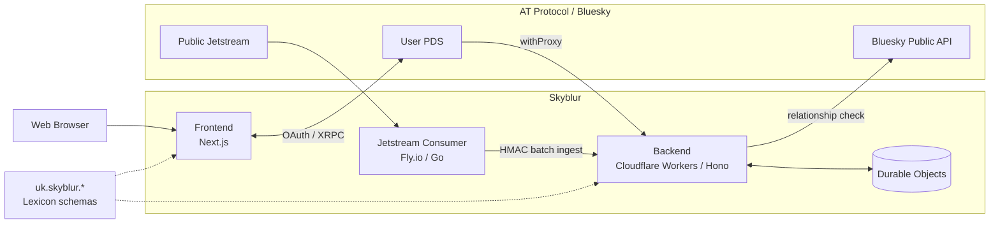
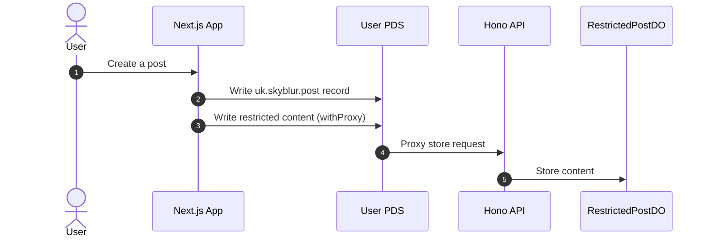
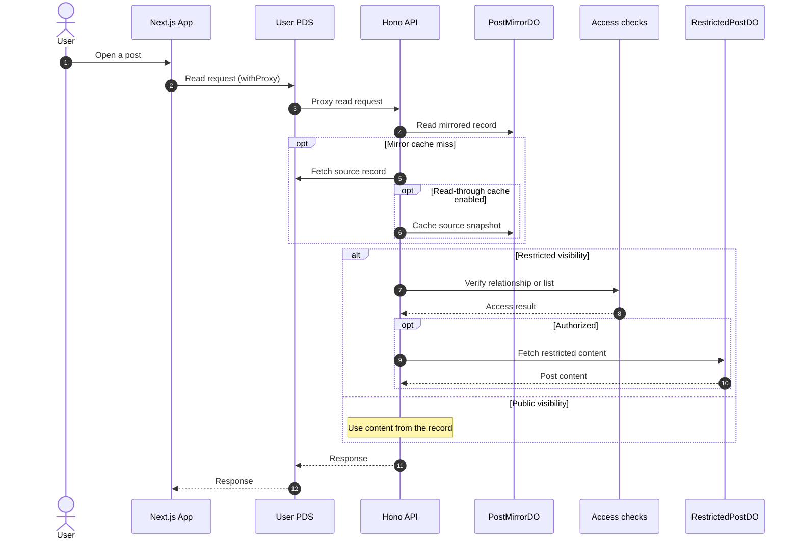
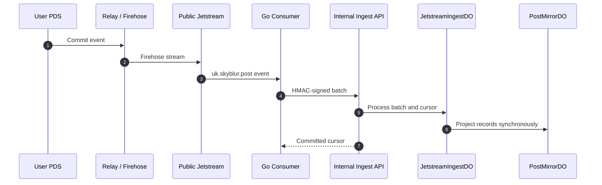

Blueskyに伏字の投稿ができる[Skyblur](https://skyblur.uk/)のソースコードです。 
This is the source code for [Skyblur](https://skyblur.uk/), a tool that allows content warning and spoiler protected posts on Bluesky.

## System Architecture / システム構成

全体構成と、投稿の保存・取得、Jetstream からの同期を分けて示します。

### Overview / 全体像

### Post write / 投稿の保存

### Post read / 投稿の取得

### Jetstream ingestion / Jetstream 同期

## Special Thanks

fig, developer of [constellation](https://constellation.microcosm.blue/) and [Slingshot](https://slingshot.microcosm.blue/). 
Skyblur retrieves Like, Repost, and Intent reactions from constellation. Skyblur uses Slingshot for API proxy.
